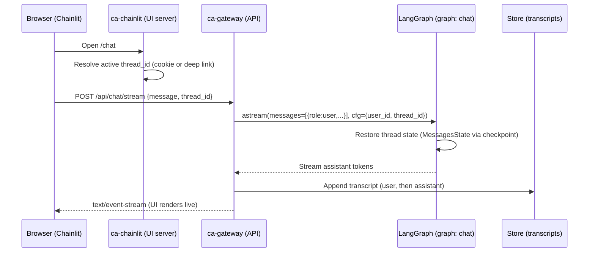

> **TL;DR**  
> Our "short‑term memory" is the **conversation state for a single thread**.  
> We persist it in two ways:  
> 1) **LangGraph checkpointed state** (so the model sees prior turns when generating the next one), and  
> 2) a **per‑thread transcript** (so the UI can render history instantly and we have an auditable record).  
> The UI keeps a stable `thread_id` via a cookie and deep links, the Gateway always attaches `thread_id` to the agent call, and LangGraph restores the prior **MessagesState** for that thread. 

---

## Why short‑term memory?

Without context, the assistant forgets what you just said. With **thread‑scoped memory**, each turn is conditioned on prior messages from the same conversation, but we don’t pollute other chats or users. That’s the practical, low‑drama kind of memory you want before any fancy long‑term memory kicks in.

---

## The shape of the system



- LangGraph restores MessagesState for the thread_id, so the agent has the whole conversation when generating the next reply.
- The Gateway streams via SSE and writes a per‑thread transcript for the UI and audit.

## The agent’s memory: LangGraph MessagesState + checkpoints
- The chat graph’s node receives state["messages"]—the entire message history for the thread—then invokes the model with that full list (plus any optional system tips). That is the short‑term memory the model sees.
```
# apps/agent-langgraph/my_agent/graphs/chat.py (trimmed)
class ChatState(MessagesState):  # holds the list of messages for the thread
    pass

def chat_node(state: ChatState, config=None, *, store=None):
    llm, messages = llm_and_messages_for_config(config, state["messages"])
    # ... (optionally prepend a memory tip; then call the LLM)
    ai_msg = llm.invoke(messages, config=config)
    return {"messages": [ai_msg]}
```

- We compile the graph with a checkpointer when running locally (in‑memory), and we rely on LangGraph Cloud/Server’s built‑in durable checkpointer in deployment—so the thread state survives scale‑to‑zero and restarts.

```
# apps/agent-langgraph/my_agent/utils/checkpointer.py (trimmed)
def make_checkpointer():
    use_local = os.getenv("LG_USE_LOCAL_MEMORY", "false").lower() in ("1","true","yes")
    if use_local and MemorySaver is not None:
        return MemorySaver()  # local-only
    return None  # Cloud provides durable Postgres checkpointer
```

## Staying on the same thread in the UI

A thread is only useful if we keep using the same thread_id across page loads and new messages.

- The UI server sets/reads a prynai_tid cookie and even supports deep links like /open/t/{thread_id} to prime that cookie before Chainlit boots. The header_auth_callback also picks up the active thread id and attaches it to the Chainlit user session.

```
# apps/chainlit-ui/src/server.py (trimmed)
@app.get("/open/t/{thread_id}")
async def open_thread(thread_id: str):
    resp = RedirectResponse(url=f"/chat/?t={thread_id}", status_code=302)
    resp.set_cookie(key="prynai_tid", value=thread_id, ...)

@cl.header_auth_callback
def header_auth_callback(headers):
    tokens = _parse_cookies(headers.get("cookie") or "")
    active_tid = tokens.get("prynai_tid") or _thread_id_from_referer(headers)
    return cl.User(identifier=identifier, metadata={"active_thread_id": active_tid, ...})
```
- We also enhance the front‑end to rebind “New Chat” to create a thread via the Gateway and set the cookie before Chainlit renders—so the first message already lands in the right thread.

## The UI shows history immediately (transcript)

- When a chat opens, the UI requests the stored transcript for the active thread_id and renders it (user/assistant turns). This way the page is instantly consistent with the agent’s memory, even before any new model call

```
  # apps/chainlit-ui/src/main.py (trimmed)
@cl.on_chat_start
async def start():
    ts = await ensure_active_thread()
    if ts and ts.thread_id:
        _set_active_thread_id(ts.thread_id)
        await _render_transcript(ts.thread_id)  # fetch & render prior messages
```
The transcript endpoint reads a single object per thread (key="transcript") and returns the ordered list of {role, content, ts} messages.

## The Gateway ties it together (thread + SSE + transcript writes)

- The streaming endpoint attaches user_id and thread_id to the LangGraph config (creating or resuming a thread if missing), immediately appends the user turn to the transcript, and then streams tokens. After streaming, it appends the assistant turn. That’s the short‑term record the UI shows and the agent relies on next time.

```
# apps/gateway-fastapi/src/main.py (trimmed)
config = build_langgraph_config(payload)
config.setdefault("configurable", {})["user_id"] = user_id

# Resolve a thread if missing (resume newest or create one)
if not thread_id:
    results = await client.threads.search(metadata={"user_id": user_id}, limit=1)
    thread_id = results[0]["thread_id"] if results else (await client.threads.create(...))["thread_id"]
    config["configurable"]["thread_id"] = thread_id

# Write user turn now; assistant after streaming completes
await append_transcript(client, user_id, thread_id, TranscriptMessage(role="user", content=payload.message))
# ... stream SSE from LangGraph ...
await append_transcript(client, user_id, thread_id, TranscriptMessage(role="assistant", content="".join(acc)))
```
- The transcript helpers store one value under ["threads", user_id, thread_id] → key="transcript", containing the messages array (we sort by ts on read).

## Threads are real resources (CRUD)

- We expose a simple Threads API so the UI can create/list/rename/delete conversations and keep your sidebar tidy. Each thread is owned by a user via metadata; delete falls back to a soft‑delete registry if a hard delete isn’t available in the SDK.
```
- # apps/gateway-fastapi/src/features/threads.py (trimmed)
@router.post("")
async def create_thread(...):
    t = await client.threads.create(metadata={"user_id": user_id, "title": payload.title or None})
    return _summarize(t)
```

## How short‑term and long‑term memory interact

- Short‑term memory (this post) = the conversation state (MessagesState + transcript) for the thread_id.
- Long‑term memory = a separate feature that retrieves compact user/episodic snippets and prepends them as a small system tip, then writes fresh facts/summaries after the turn. It’s orthogonal to thread state; we only add a few hundred characters of helpful context. (See the long‑term memory blog.)

## What we get from this design

#### Deterministic context per thread:
- The model always sees prior turns for that conversation
#### Reload‑proof UX:
- deep link + cookie ensures the right thread survives refresh.

#### Scale‑to‑zero friendly:
- LangGraph’s checkpointed state persists between runs; we don’t need to ship the entire transcript with each request.
#### Auditable history:
- a transcript we can render, search, or export later—separate from the agent’s internal state.

## Operational knobs & edges
- If a request arrives without a thread_id, the Gateway finds or creates one so the turn is never orphaned.
- The UI’s “New Chat” is rebased to the Gateway endpoint so cookies are set atomically. This avoids Chainlit’s default modal flow and thread mismatch at first turn.
- Transcripts are append‑only today; a “Manage transcript” UI is on our wishlist (soft delete already exists for threads).

## Code hotspots (jump list)

#### Agent state & compile:
- my_agent/graphs/chat.py (uses MessagesState; compiles with optional checkpointer).

#### Checkpointer policy:
- my_agent/utils/checkpointer.py (local MemorySaver vs Cloud’s durable checkpoint).

#### Gateway streaming + transcript writes:
- gateway-fastapi/src/main.py.

#### Transcript storage & API:
- gateway-fastapi/src/features/transcript.py.

#### Threads CRUD:
-gateway-fastapi/src/features/threads.py.

#### UI thread bootstrap & cookie bridge:
- chainlit-ui/src/server.py and public/login-redirect.js.

#### UI chat start & transcript rendering:
---chainlit-ui/src/main.py.

#### Takeaway:
- Short‑term memory doesn’t need a Rube Goldberg machine. Give each conversation a real thread id, let LangGraph checkpoint your MessagesState for that thread, and keep a human‑readable transcript on the side. It survives reloads and cold starts, keeps turns coherent, and stays easy to reason about.
  
