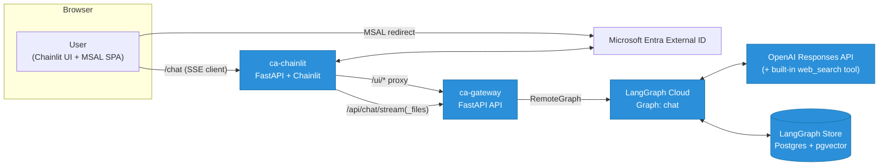
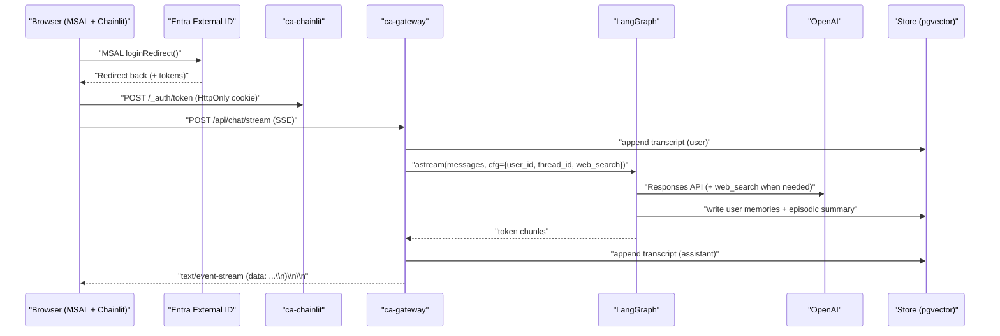

**TL;DR**  
- We needed an AI chat that streams in real time, remembers users, signs in with enterprise identity, and costs close to $0 when idle.  
- The big calls: **SSE** for streaming, **Microsoft Entra External ID (CIAM) + MSAL** for sign‑in, **OpenAI Responses API + built‑in web search** for the agent, and **LangGraph Store (pgvector)** for long‑term memory. We document these as ADRs so anyone can reuse or challenge them.  
- References: SSE spec/MDN, MSAL guidance, OpenAI tool docs, LangGraph Store, C4 model, ADR practice.

## Context & constraints
- Traffic is small and spiky (some days near idle), so **scale‑to‑zero** matters.
- We want **enterprise‑friendly sign‑in** and a clear token‑validation story.
- The UI must **stream** tokens as they’re generated.
- The assistant should **remember** durable facts and past episodes without us building a bespoke vector stack.

## System at a glance (C4 “Containers”)



## ADRs (Architecture Decision Records)

- Each ADR has Context → Options → Decision → Consequences. These are not dogma; they record our current best trade‑offs

### ADR‑001 — Streaming: SSE vs WebSockets vs Polling

#### Context.
- We need a low‑friction way to stream model tokens to the browser through typical proxies/CDNs.

#### Options.
- SSE (Server‑Sent Events) — HTTP response with text/event-stream, browser EventSource, multi‑line data: frames, simple reconnect.

#### Consequence.
- First‑class streaming with minimal infra friction. Here’s the tiny server helper that respects the SSE framing (multiple data: lines per event; blank line terminates):
HTML Living Standard
- WebSockets — full duplex, more control but trickier through some corporate proxies/load balancers.
- Polling — simple but wasteful and jittery UX.
#### Decision.
- SSE. The event format is standardised, widely supported, and trivial to implement on both ends

  ```
  def sse_event(text: str) -> bytes:
    t = text.replace("\r\n", "\n").replace("\r", "\n")
    payload = "data: " + t.replace("\n", "\ndata: ")
    return (payload + "\n\n").encode("utf-8")  # per spec
  ```

#### Trade‑off table

| Approach | Pros | Cons |
|---|---|---|
| SSE | Simple HTTP, proxy‑friendly, auto‑reconnect; native `EventSource`. | Server→client only; no binary. |
| WebSockets | Full duplex, binary. | Heavier setup; occasionally brittle via corporate proxies. |
| Polling | Easiest infra. | Latency & cost; poor UX for token streams. |

## ADR‑002 — Identity: Microsoft Entra External ID (CIAM) + MSAL (browser redirect)

#### Context.
- We need customer/partner sign‑in, standards‑based tokens, simple browser integration, and clear pricing.
#### Options.
- Entra External ID (CIAM), social IdPs directly, or roll‑your‑own.
#### Decision.
- Entra External ID with MSAL (msal‑browser) redirect flow. We call handleRedirectPromise() on each load, then bridge the access token into an HttpOnly cookie for the UI session; the API gateway validates JWTs via OIDC discovery & JWKS.
- #### Consequence.
-  Works with enterprise and social logins, and the first 50,000 monthly active users are free on the core tier; add‑ons (e.g., SMS) can incur costs
 
```
// Run on page load (always await it for redirect flows)
const result = await msalInstance.handleRedirectPromise();
const account = result?.account || msalInstance.getAllAccounts()[0];
// ...acquire token silently or redirect
```

## ADR‑003 — Request path: UI → Gateway → LangGraph (RemoteGraph)

#### Context
- We want streaming and transcripts without exposing provider keys in the browser.
#### Options
- UI calls model APIs directly; or a gateway brokers auth, moderation, transcripts, streaming.
#### Decision
- A thin gateway that: validates JWTs, moderates input/output, writes transcripts, and streams tokens over SSE to the UI.
#### Consequence
- Centralised policy and observability; clean separation of concerns; no secrets in the browser.

## ADR‑004 — Agent runtime: OpenAI Responses API + built‑in web_search tool
#### Context
- We need a stable tool‑use surface (browse when needed), good streaming, and simpler tool binding than bespoke function‑calling glue.
#### Options
- Legacy Chat Completions + manual tool wiring; or Responses API with native tools.
#### Decision
- Responses API with the built‑in web_search tool. The tool is enabled in the tools array and can be forced for time‑sensitive queries.
#### Consequence
- Less glue code, clearer semantics; we can cite sources in responses when browsing is used.

## ADR‑005 — Memory: LangGraph Store (pgvector) with user + episodic namespaces
#### Context
- We want durable “user” facts (preferences) and compact per‑turn “episodic” summaries without managing our own embeddings/index infra.
#### Options
- DIY vector DB; or use LangGraph Store and its pgvector integration.

#### Decision
- LangGraph Store with a configured vector index; retrieve before the turn, write memories after. Long‑term memory is a documented LangGraph pattern.

#### Consequence.
- Fewer moving parts; we can scale memory independent of the chat worker graph. LangGraph also provides persistence/threading semantics we leverage elsewhere.

#### Consequence.

## ADR‑006 — Cost profile: Scale‑to‑zero for UI & Gateway; pin to 1 only when latency demands it

#### Context
- Idle periods dominate. First hit after idle can tolerate a short cold‑start, but not in every path.
#### Decision.
- Default minReplicas: 0 for both containers; selectively set minReplicas: 1 for the gateway if we ever need instant first‑byte for auth/health endpoints.

#### Consequence.
- Near‑zero idle cost; occasional cold‑start when traffic resumes. (We trimmed image size and added readiness probes to make this palatable.)

## ADR‑007 — Uploads: Server‑side, semantic‑only ingestion (+ optional OCR)

#### Context.
- Users drop PDFs/PowerPoints/etc. We want semantic context, fast, without code execution risk.
#### Decision.
- Extract text server‑side (pure‑Python parsers; optional OCR for images/PDFs) and inject a compact “ATTACHMENTS CONTEXT” system message. We cap size/types and never execute content.

- ### Consequence.
  - Consistent TTFT, predictable tokens, safer surface.
 
  ## ADR‑008 — Threads & transcripts: Gateway‑owned CRUD + per‑thread transcript

  #### Context
  - Users expect continuity; we want stable URLs and auditability.
  #### Decision
  - A threads API (create/list/get/rename/delete) and a per‑thread transcript in Store. UI deep‑links via /open/t/{id} and keeps an active thread cookie.
  ### Consequence
  - Conversations are durable, shareable (internally), and searchable later
 
## Sequence: auth + chat streaming



- SSE is a standard EventSource API with a simple wire format; MDN and the WHATWG HTML standard document both.
- MSAL redirect flows must await handleRedirectPromise() on each load; this avoids race conditions.

## What surprised us (and what we’d change)

#### SSE just works.
-  No custom infra, no proxy tantrums, and reconnection is boring—in a good way. Spec and MDN are clear about the wire format.
#### MSAL redirect timing matters.
-  Waiting for handleRedirectPromise() on every load prevented subtle “ghost account” bugs.
#### Memory wants boundaries.
-  Keeping “user” vs “episodic” separate improved retrieval relevance and kept long‑term summaries tiny. LangGraph’s store/API surface made it straightforward.
 
## What you can reuse

#### Streaming?
- Start with SSE unless you can prove you need WS; the standard and MDN guides are enough to implement it quickly.
#### Identity for external users? Entra External ID + MSAL
- gives you standards‑based tokens and a clean browser story, with generous 50k free MAUs to start.
#### Agent with memory? Responses API + LangGraph Store
- sweet spot between capability and complexity
#### Diagrams?
- Use C4 (container‑level) to align the team fast.
  

    
