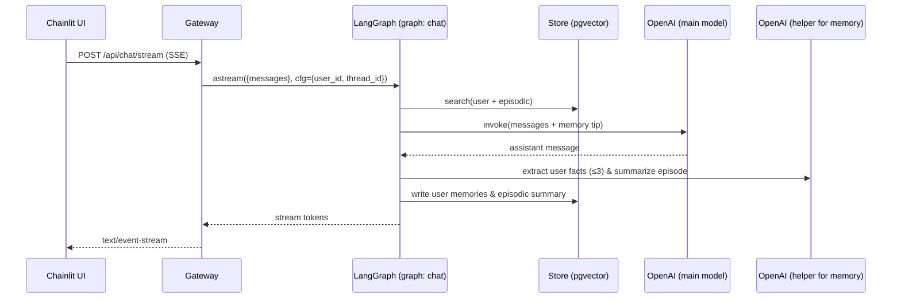

**TL;DR**  
- We keep two kinds of long‑term memory—**user** (durable facts/preferences) and **episodic** (one‑line summaries of past turns).  
- On every user message we **retrieve** relevant memories to give the model context; after the model replies we **write** new memories.  
- It’s implemented with **LangGraph Store** + a small helper LLM for structured extraction and summarization. Defaults: retrieve up to **4** user + **4** episodic hits, **900** chars of context, and write **≤3** new user facts.


## Why memory (and why this design)

We wanted the assistant to remember stable preferences (“prefers terse answers”, “works in IST”) *and* recall the gist of prior tasks without rereading entire transcripts. The tricky part was doing this **simply** and **safely**:

- Keep memory **scoped** to a user (not global).  
- Keep context **small and relevant**.  
- Avoid bespoke vector plumbing; use the platform store.

So we split memory into **user** and **episodic**, perform a quick semantic search before generation, and save compact memories after generation. The code lives in `my_agent/features/lt_memory.py` and is wired into the chat graph in `my_agent/graphs/chat.py`. :contentReference[oaicite:2]{index=2}:contentReference[oaicite:3]{index=3}

---

## Data model (two namespaces)

We store memories in LangGraph Store with clear namespaces:

- **User** memory (durable facts/preferences):  
  `("users", <user_id>, "memories", "user")` :contentReference[oaicite:4]{index=4}

- **Episodic** memory (one‑line summaries of past exchanges):  
  `("users", <user_id>, "memories", "episodic")` :contentReference[oaicite:5]{index=5}

Each item records text, type, `source_thread`, and timestamp; we index by `"text"` for search. The store itself has a vector **index** declared in `langgraph.json` using `openai:text-embedding-3-small` (dims **1536**) across the `"$"` field, which enables semantic retrieval. :contentReference[oaicite:6]{index=6}

---

## Retrieval (before the model thinks)

Just before we call the main model, we search both namespaces using the user’s latest message as the query:

```python
# my_agent/graphs/chat.py (trimmed)
hits = search_relevant_memories(store, user_id, last_user_text, k_user=4, k_episodic=4)
tip  = memory_context_system_message(hits, max_chars=900)
if tip is not None:
    messages = [tip] + list(messages)  # prepend one compact system tip
```
- We request up to 4 user + 4 episodic hits.
- We build a single system message limited to 900 characters to keep context small and latency friendly.
- Formatting: • bullets for user facts, – dashes for episodic summaries.
- All of that is in lt_memory.py and the chat node wiring in chat.py.3

## Writing (after the model replies).

We save two kinds of memories after each assistant turn:

- ### Durable user facts
- (if any were implied by the user’s latest message).
- We ask a small helper model to extract at most 3 short, stable facts, using structured output so we only ever store a list of strings:
  
```
# my_agent/features/lt_memory.py (trimmed)
class ExtractedMemories(BaseModel):
    # STRICT schema for Responses API
    model_config = ConfigDict(extra="forbid")
    memories: List[str]

# ...
parsed = llm.with_structured_output(ExtractedMemories, strict=True).invoke(doc)
# store up to 3 new items under ("users", user_id, "memories", "user")

```
- The schema is strict (extra="forbid") to avoid sloppy structures or surprise fields.
- We record the source_thread and timestamp; each memory is indexed by text for semantic search later.

### One‑line episodic summary of this exchange (user prompt + assistant reply):
```
# my_agent/features/lt_memory.py (trimmed)
instr = "Summarize this exchange in one short sentence..."
summ = (llm.invoke(doc).content or "").strip()
# store as type="episodic" under ("users", user_id, "memories", "episodic")

```
- This keeps future retrieval fast and targeted; we don’t need to re‑read entire transcripts to recall the gist.
- Both writes are triggered by the chat node after the main model returns, and they’re wrapped in try/except to never block the turn.

## End‑to‑end flow (diagram)


- The user_id gets attached to the graph config by the Gateway so memory is properly scoped per user.
- The store’s vector index is declared at deploy‑time in langgraph.json; we don’t manage embeddings manually in the agent.

## The small but important details

#### Search API & scoring.
- We call store.search(ns, query=..., limit=k) on each namespace, collect (key, text, score), and sort descending. Then we format bullets into one compact system message (900 char cap).

#### Formatting that helps the model:
- The system tip starts with a short instruction—“You have durable memory about this user and prior episodes…”—followed by bulleted facts (•) and episodic hints (–). This makes the signal obvious to the model without over‑conditioning.
#### Helper model settings
- The memory helper uses a small model with Responses API, reasoning effort: low, temperature 0, and no streaming for predictability and cost control.
#### Thread awareness.
- When we write a memory, we include source_thread so we can trace where it came from. Retrieval is user‑scoped (not thread‑scoped) by design, to maximize reuse of durable knowledge
#### No stalls
- Writes are best‑effort with exceptions swallowed; a failed memory write never slows a user turn.
## Deployment bits (where the store/index comes from)
- The LangGraph Store is wired in the deployment: our langgraph.json declares the vector index:
```
{
  "store": {
    "index": {
      "embed": "openai:text-embedding-3-small",
      "dims": 1536,
      "fields": ["$"]
    }
  }
}

```
- That’s enough to get semantic store.search(...) working for our namespaces. We do not run a separate vector service or write embedding code inside the agent.

## Knobs you can tune

- Retrieval sizes: k_user=4, k_episodic=4 (per turn).
- System tip size: max_chars=900.
- Extraction cap: ≤3 user memories written per turn.
- Embeddings/index: text-embedding-3-small, dims 1536 (declared in JSON).

## Privacy & scope
- Memories are per‑user namespaces; there’s no cross‑user search.
- Each item records source_thread and timestamp, giving you auditability and an easy path to UI “manage memory” features later.

## Code hotspots (read this alongside)

- Memory helpers (search, tip, extract, summarize):
apps/agent-langgraph/my_agent/features/lt_memory.py

- Chat node wiring (retrieve before, write after):
apps/agent-langgraph/my_agent/graphs/chat.py

- Store/index config (embeddings & dims):
apps/agent-langgraph/langgraph.json

- Gateway passes user_id / thread_id into agent config:
apps/gateway-fastapi/src/main.py (both /api/chat/stream and /api/chat/stream_files)
